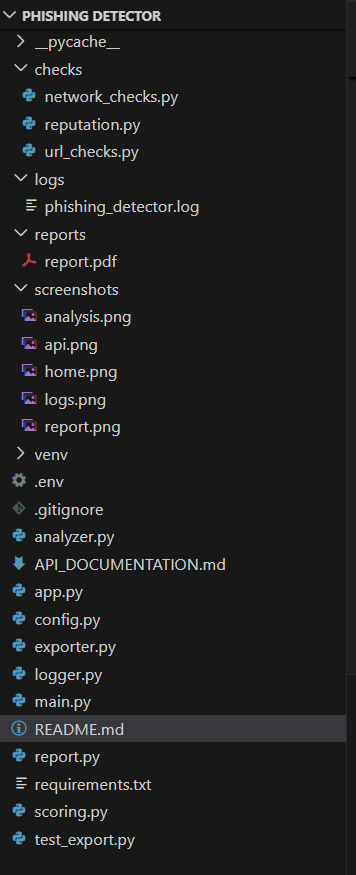
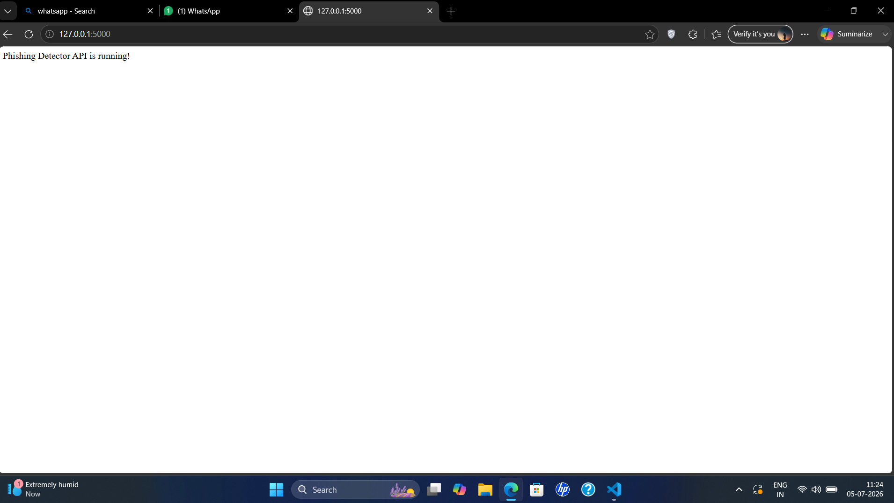
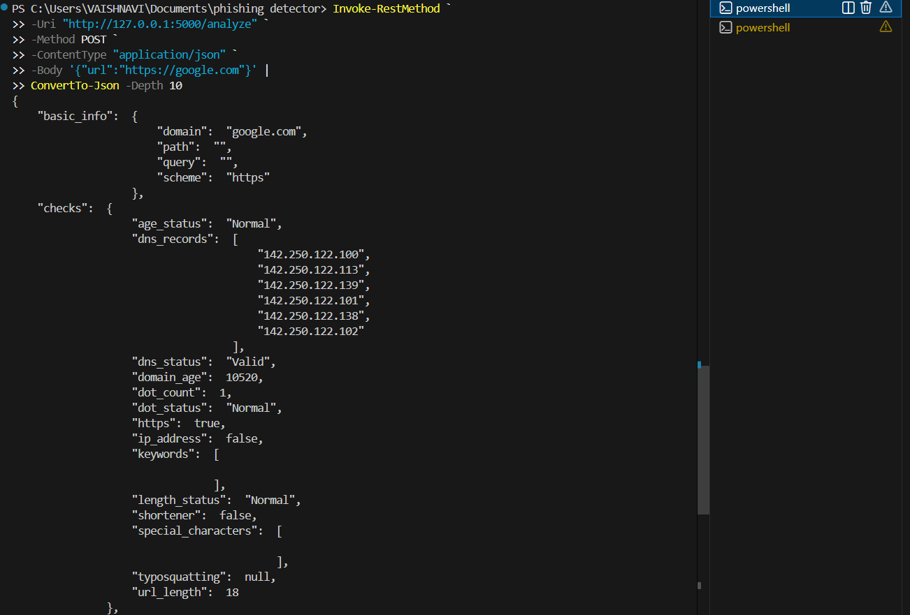
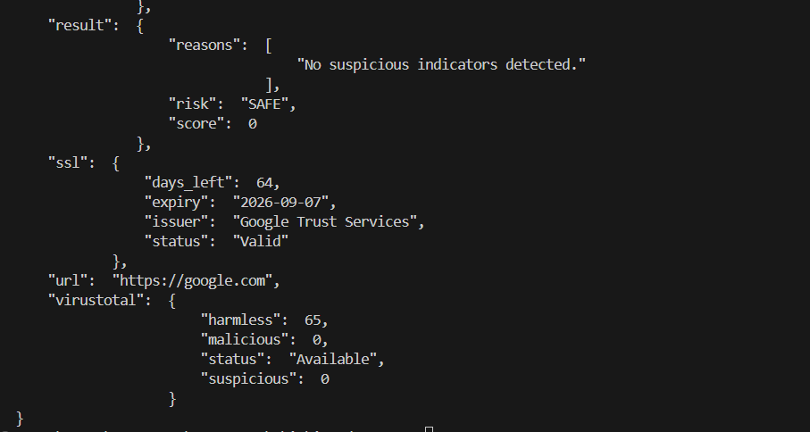
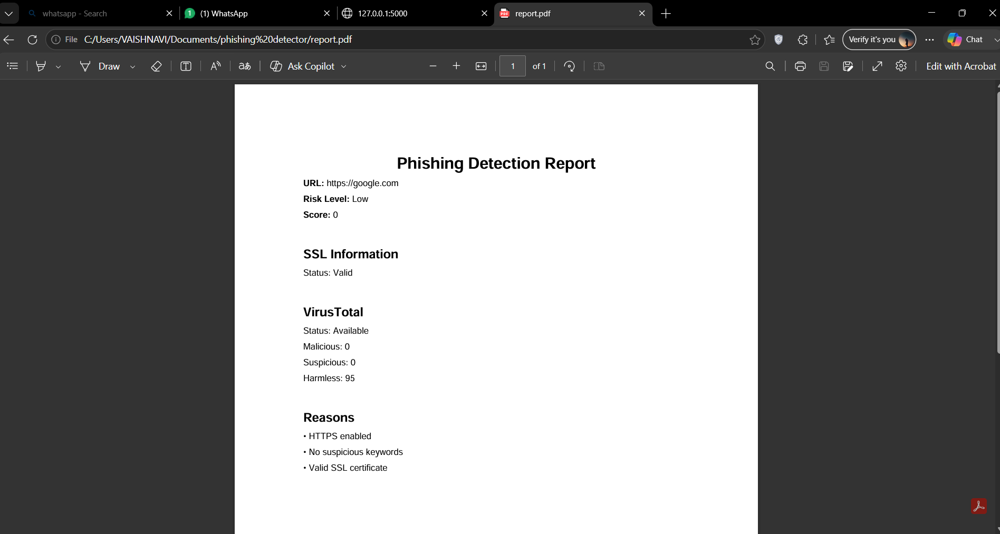
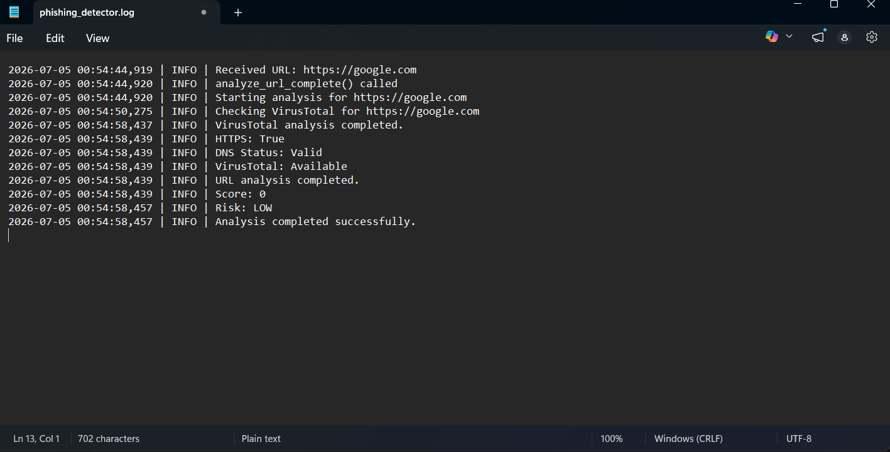

# Phishing Detector

A Python-based phishing URL detection system that analyzes URLs using multiple security checks and returns a phishing risk score.

## Features

- URL parsing
- HTTPS detection
- Suspicious keyword detection
- IP address detection
- URL length analysis
- Dot count analysis
- URL shortener detection
- Special character detection
- Typosquatting detection
- Domain age lookup
- DNS validation
- SSL certificate analysis
- VirusTotal reputation check
- Weighted phishing scoring
- REST API using Flask
- JSON report export
- PDF report export
- Logging support

---

## Project Structure

```
phishing_detector/
│
├── app.py
├── analyzer.py
├── scoring.py
├── report.py
├── logger.py
├── exporter.py
│
├── checks/
│   ├── url_checks.py
│   ├── network_checks.py
│   └── reputation.py
│
├── reports/
├── logs/
├── README.md
└── requirements.txt
```

---

## System Architecture

```
User
   │
   ▼
Frontend (Web Interface)
   │
   ▼
Flask REST API
   │
   ▼
Analysis Engine
   │
   ├── URL Checks
   ├── DNS Lookup
   ├── SSL Analysis
   ├── WHOIS
   ├── VirusTotal
   │
   ▼
Scoring Engine
   │
   ▼
JSON Response / PDF Report
```

---

## Installation

Clone the repository

```bash
git clone <repository-url>
```

Create a virtual environment

```bash
python -m venv venv
```

Activate it

Windows

```bash
venv\Scripts\activate
```

Install dependencies

```bash
pip install -r requirements.txt
```

---

## Running the Project

Start the API

```bash
python app.py
```

Server starts at

```
http://127.0.0.1:5000
```

---

## API Endpoint

### POST /analyze

Request

```json
{
    "url":"https://google.com"
}
```

Response

```json
{
    "url":"https://google.com",
    "basic_info":{...},
    "checks":{...},
    "ssl":{...},
    "virustotal":{...},
    "result":{
        "score":0,
        "risk":"SAFE",
        "reasons":[]
    }
}
```

---

## Technologies Used

- Python
- Flask
- Requests
- python-whois
- dnspython
- ReportLab
- VirusTotal API

---

---

## Screenshots

### 1. Project Structure

The project is organized into separate modules for URL analysis, scoring, logging, report generation, and the Flask REST API. This modular architecture improves maintainability and makes it easier to extend the application with additional phishing detection techniques.



---

### 2. Flask Backend Running

The Flask application successfully starts the REST API server, making the phishing detector available for analysis requests.



---

### 3. URL Analysis Request

A client sends a POST request containing a URL to the `/analyze` endpoint. The backend receives the request and begins the phishing analysis process.

Example Request:

```json
{
    "url": "https://google.com"
}
```



---

### 4. Phishing Analysis Response

The detector returns a structured JSON response containing the URL's basic information, security checks, SSL analysis, VirusTotal reputation, and the final phishing risk assessment.



---

### 5. Generated PDF Report

After completing the analysis, the application can generate a PDF report summarizing the phishing detection results, including the URL, risk level, score, SSL status, VirusTotal results, and reasons contributing to the final assessment.



---

### 6. Application Logging

The application records important events such as incoming requests, analysis progress, VirusTotal checks, and completion status using Python's logging module. These logs help with debugging and monitoring the system.



---

### 7. Web Interface *(Optional)*

The backend is designed to integrate seamlessly with a web frontend. Users can enter a URL, submit it for analysis, and view the phishing detection results through a graphical interface.

*(Add this screenshot after the frontend is completed.)*


## Future Improvements

- Machine Learning classifier
- Email phishing detection
- QR code phishing detection
- Browser extension
- Real-time URL monitoring
- Threat intelligence feeds

---

## Author

Vaishnavi